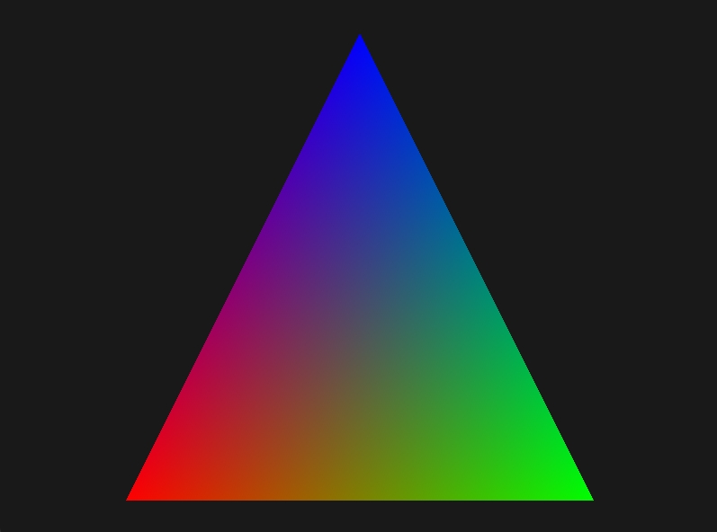
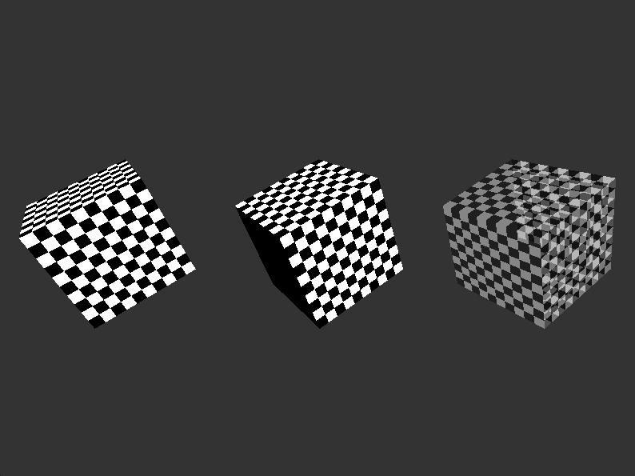
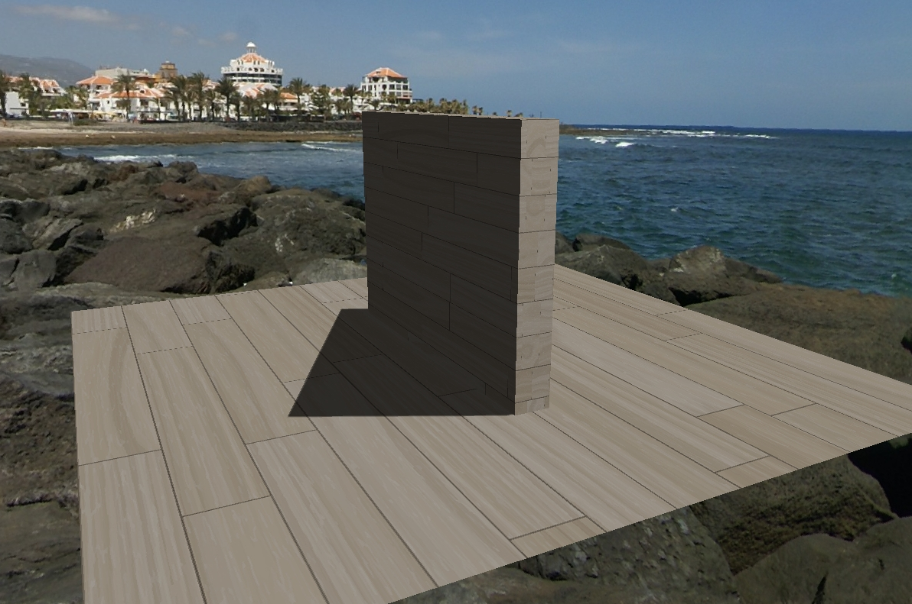
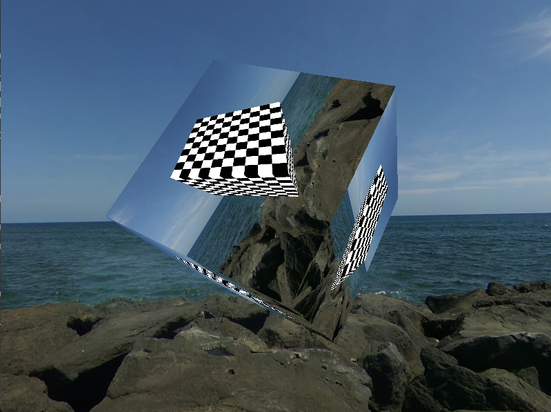

## Feature Overview
- 3D Object Management
	- Basic affine transformations
	- Mesh(Geometry, Material)
	- Parent-child relationship construction
- Camera and Camera Control
	- Perspective projection camera
	- Orthographic projection camera
	- Game-style camera control
	- Trackball-style camera control
- Texture 
	- 2D and cube texture loading
	- Wrapping
	- Filtering
- Shader
	- ShaderChunk: GLSL code snippets
	- ShaderLib: Combines GLSL snippets into complete shaders
- Uniform
	- Basic uniform data structure
	- Pure array uniform
	- Structure uniform
- Material
	- ShaderProgram
	- Phong material
	- Basic material
	- Transparent material
- Lighting and Shadow
	- Directional light and its shadows
	- Ambient light
- Window
	- Window attribute settings
	- Window callback 
- Offscreen Rendering

## Demo

### Draw Triangle

### Lighting and Transparency

### Shadow

### Offscreen Rendering

